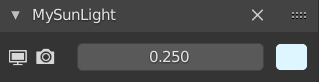

# Lightdesk

Lighting add-on for Blender 2.8+

Lightdesk provides a lighting control panel located in the sidebar of the 3D view.
Add lights from within the current scene to lighting channels on this desk. Control the visibility, power, and color of multiple lights from one location. Adjust and experiment with your scene lighting without having to hunt/click lights and constantly clicking between 3D, Outliner, and property views.

## Installation
Install using one of these methods:

* Download the repository as a zip file and install from anywhere, [as per the Blender manual](https://docs.blender.org/manual/en/latest/editors/preferences/addons.html)
* Download and copy `__init__.py` to a subfolder within your Blender installation add-ons directory, e.g. `C:\Program Files\Blender Foundation\Blender 2.90\2.90\scripts\addons\lightdesk`, then enable within Blender preferences.

## Usage

Select the Lightdesk tab in the sidebar of the 3D view to display the Scene Lights panel.

This lists all of the light objects in the current scene. The toggle buttons above may be used to filter the list by light type. Standard filter and sort by name options are available from the drop-down section at the foot of the list.

Select a light in the list and click the Add button to create a new lighting channel and assign the selected light to it. Alternatively, click Add All to quickly create channels for all the lights currently displayed in the light list. Click Delete All to delete all current channels, or remove specific channels by clicking the Delete button in the channel headers.

By default, channels appear below Scene Lights, but all panels can be drag-dropped to reorder and collapsed when additional screen space is required.

Each channel header contains the name of the associated light and a Delete button. Note that clicking the Delete button only removes the channel from Lightdesk and will not delete the associated light object.

The light controls within each channel are, from left to right:

1. Toggle viewport visibility
2. Toggle render visibility
3. Light power
4. Light color

These controls merely expose the underlying light properties and all are animatable from within Lightdesk thanks to Blender's RNA system.

Lightdesk channels and settings are configured per scene and are saved with the `.blend` file, so your channel setup will be recreated next time your project is loaded. Note that, at present, Lightdesk cannot preserve custom ordering of channels between file loads or scene switches and instead will recreate channels in the order that they were originally added.

## Disclaimer

Lightdesk was initially developed to help with lighting setups in my own personal projects, where adjusting a large number of lights was proving a tedium of clicking back and forth between 3D view, scene outliner, and property panels. This add-on is provided as-is and free for use under GNU GPL. I am not a professional developer and make no claims for the quality of the design or implementation, nor its robustness, safety, performance, usefulness, or indeed any other characteristic.

Although I do not intend any further development or to provide ongoing support, if you report any issues here and I will endeavour to address them as best I can. Thanks in advance for your feedback, I hope that Lightdesk proves of some help to you in your creative endeavours.
