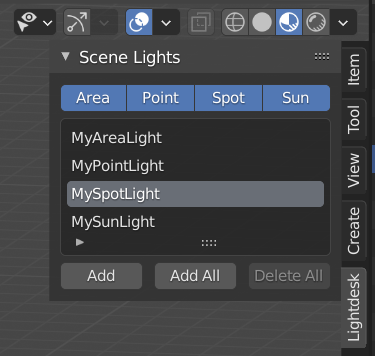
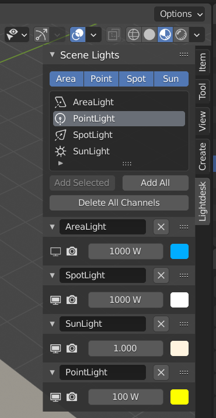

# Lightdesk

An add-on for Blender 2.8+

Lightdesk provides a lighting control panel located in the sidebar of the 3D view.
Add lights within the current scene to lighting channels on this desk. Control the visibility, power, and color of multiple lights from this one location. Adjust and experiment with your scene lighting without having to hunt/click lights in the 3D/Outliner views then select their light properties tab.

## Installation
Either install lightdesk.zip from anywhere, [as per usual with add-ons](https://docs.blender.org/manual/en/latest/editors/preferences/addons.html), or copy all the files to a subfolder within your Blender installation add-ons directory, e.g. `C:\Program Files\Blender Foundation\Blender 2.90\2.90\scripts\addons\lightdesk`

## Usage

Select the Lightdesk tab in the 3D view sidebar ('N') to display the Scene Lights panel.

This lists all of the light objects in the current scene. The toggle buttons above may be used to filter the list by light type. Standard filter and sort-by-name options are also available from the drop-down section at the foot of the list.

Select a light from the list and click Add Selected to create a new lighting channel and assign the selected light to it.
Optionally, click Add All to quickly create channels for all the lights currently displayed in the light list.

Each channel header contains the name of the light object and a Delete Channel button. Note that clicking the Delete Channel button will not delete the associated light object, only remove that channel from Lightdesk. Channels can be drag-dropped to reorder and collapsed when additional screen space is required.

Operators within each channel are, from left to right:

1. Show/hide the light in the viewport

2. Show/hide the light in the render

3. Light power

4. Light color

Lightdesk channels and settings are configured per scene and are saved with the .blend file, so your channel setup will be recreated next time you load your project.

## Note

This add-on is provided as-is and without restriction for use under GNU GPL. It was initially developed to help with lighting setups in my own personal projects, where adjusting a large number of lights was proving a tedium of clicking back and forth between views and property panels. Feel free to use, distribute, fork, adapt, extend, or abuse this in any manner that you wish. I am not a professional developer and make no claims for the quality of the design or implementation, nor its robustness, safety, performance, usefulness, or indeed any other characteristic. It might make you 0.2% more sexy... although this may be difficult to prove.
