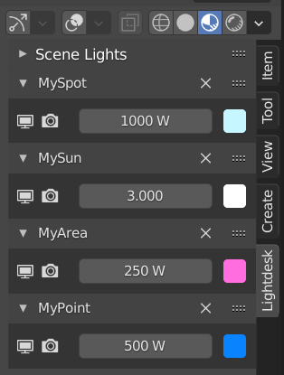

# Lightdesk

Lighting add-on for Blender 2.8+

Lightdesk provides a lighting control panel located in the sidebar of the 3D view.
Add lights from within the current scene to lighting channels on this desk. Control the visibility, power, and color of multiple lights from one location. Adjust and experiment with your scene lighting without having to hunt/click lights and constantly clicking between 3D, Outliner, and property views.

## Installation
Install using one of these methods:

* Download the repository as a zip file and install from anywhere, [as per the Blender manual](https://docs.blender.org/manual/en/latest/editors/preferences/addons.html)
* Download and copy `__init__.py` to a subfolder within your Blender installation add-ons directory, e.g. `C:\Program Files\Blender Foundation\Blender 2.90\2.90\scripts\addons\lightdesk`, then enable within Blender preferences.

## Usage

Select the Lightdesk tab in the sidebar of the 3D view to display the Scene Lights panel.

This lists all of the light objects in the current scene. The toggle buttons above may be used to filter the list by light type. Standard filter and sort by name options are available from the drop-down section at the foot of the list.

Lights are assigned to channels, with channels exposing controls to adjust the associated light's properties.

* Select a light in the Scene Lights list and click the Add button to create a new lighting channel and assign the selected light to it. This option is disabled if the currently selected light has already been assigned to a channel.
* Click Fill to quickly create channels for all the lights currently displayed in the lights list. Only lights that are not currently assigned to a channel will be added.
* Click Purge to immediately remove all current channels. Channels can also be removed individually by clicking the Delete button in each channel header.

By default, channels appear below Scene Lights, but all panels can be drag-dropped to reorder and collapsed when additional screen space is required.

Each channel header contains the name of the associated light and a Delete button. Note that clicking the Delete button only removes the channel from Lightdesk and will not delete the associated light object.

The light controls within each channel are, from left to right:

1. Toggle viewport visibility
2. Toggle render visibility
3. Light power
4. Light color

These controls merely expose the underlying light properties and all are animatable from within Lightdesk thanks to Blender's RNA system.

Lightdesk channels and settings are configured per scene and are saved with the `.blend` file, so your channel setup will be recreated next time your project is loaded.

## Known Issues
1. The re-ordering of panels is not currently tracked or persisted in the scene data or the `.blend file`. The next time your project is loaded the channels will be recreated in the order that they were originally assigned to Lightdesk, not the display order they were in when the `.blend` file was saved.
2. When the type of a light is changed in the object properties panel, e.g. from a Spot to a Point light, the Scene Lights panel will not immediately reflect this change until a redraw event is triggered, for example by a mouse-over event. This may briefly result in the light being shown in the Scene Lights list when it should be hidden according the current light filters and its new type, or vice-versa. My current thought is that this discrepancy is acceptable given its very brief appearance and the relative complexity of tracking and responding to type changes for all lights in the scene.

## Potential Improvements
1. Add the ability to assign multiple lights per channel, dynamically creating property drivers for all child lights. To my own view, this doesn't add enough value to justify the non-trivial cost of development, but someone more experienced than myself may see this value proposition differently and wish to do something with the idea.
2. Expose more type-specific properties in the channels. The current set of light properties were chosen because they are common to all light types and are probably the most frequently used when fine-tuning a light setup, but perhaps there is potential for type specific panel sub-classes.
3. Add config options for panel operator layout, e.g. perhaps an optional condensed view with the property operators moved from the panel body into the header. This could allow for a greater number of slimline panels to be added to the 3D view before having to scroll up and down through a list. The raison d'etre of this add-on is to eliminate clicks and make light adjustments quicker/easier. Big scenes with a lots of lights may require scrolling a stack of channels, making this add-on redundant. But then, channels can be added/removed/rearranged within Lightdesk so trivially that it shouldn't prove a problem. Again, this appears to be a lot of work for apparently scant payback.
4. First and foremost I have focused on making something that works and meets my own needs. I am sure that I have committed all manner of architectural missteps, design pattern disasters, and coding faux-pas in doing so. *shrug* What can I say? I am not a professional developer. If you think this concept has merit and would like to 'do it properly' then please go for it. I would applaud and love to learn from someone doing that.

## Disclaimer

Lightdesk was initially developed to help with lighting setups in my own personal projects, where adjusting a large number of lights was proving a tedium of clicking back and forth between 3D view, scene outliner, and property panels. This add-on is provided as-is and free for use under GNU GPL. I make no claims for the quality of the design or its implementation, its robustness, safety, performance, usefulness, or indeed any other characteristic, and it is used at your own discretion and risk. Feel free to share, fork, adapt, or use publicly in an cautionary slideshow presentation upon the perils of hubris and a little knowledge being a dangerous thing.

At this moment I do not intend any further development or to provide ongoing support, but if you report any issues here I will endeavour to address them as best I can, as soon as I can. Thanks in advance for any feedback, I hope that Lightdesk proves of some help to you in your creative endeavours.
