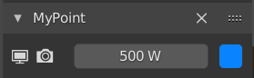

# Lightdesk

Lighting add-on for Blender 2.8+

Lightdesk provides a lighting control panel located in the 3D view sidebar. Add lights from the current scene to lighting channels on the control desk. Control the visibility, power, and color of multiple lights from one location. Adjust and experiment with your scene lighting without having to hunt/select lights and constantly click between 3D, Outliner, and property views.

## Installation
Install using one of these methods:

* Download the repository as a zip file and install from anywhere, as per the [Blender manual](https://docs.blender.org/manual/en/latest/editors/preferences/addons.html)
* Download and copy `__init__.py` to a subfolder within your Blender installation add-ons directory, e.g. `C:\Program Files\Blender Foundation\Blender 2.90\2.90\scripts\addons\lightdesk`, then enable the add-on within Blender's preferences.

## Usage

Select the Lightdesk tab in the sidebar of the 3D view to display the Scene Lights panel.

This lists all of the light objects in the current scene. The toggle buttons above may be used to filter the lights by type. Standard search, filter, and sort-by-name options are available from the drop-down button at the foot of the list.

Lights can be assigned to channels, which expose a set of controls to adjust the light's properties.

**Add** - Create a new lighting channel and assign the selected light to it. This option is disabled if the selected light is already assigned to a channel.

**Fill** - Create channels for all lights currently displayed in the list. Only lights that are not currently assigned to a channel will be added.

**Purge** - Remove all current channels. Channels can also be removed individually by clicking the Delete button in each channel header.

!

By default, channels appear below Scene Lights, but all panels can be drag-dropped to reorder and collapsed when additional screen space is required.

Each channel header contains the name of the associated light and a Delete button. Note that clicking the Delete button only removes the channel from Lightdesk and does not delete the associated light object.

The light controls within each channel are, from left to right:

* Toggle viewport visibility
* Toggle render visibility
* Light power
* Light color

These controls expose the underlying light properties, all of which are animatable from within Lightdesk thanks to Blender's RNA system.

Lightdesk channels and settings are configured per scene and are saved with the `.blend` file, so your channel setup will be recreated next time your project is loaded.

## Known Issues
1. The re-ordering of panels is not currently tracked or persisted in the scene data or the `.blend file`. The next time your project is loaded the channels will be recreated in the order that they were originally assigned to Lightdesk, not the display order they were in when the `.blend` file was last saved. The means of doing this are currently beyond me, but if anyone can figure out how to capture re-ordering events or expose that data via the current Blender API then this should be relatively trivial to achieve. Please let me know if you have any ideas on how to do this.
2. When the type of a light is changed in the object properties panel, e.g. from a Spot to a Point light, the Scene Lights list will not immediately reflect this change until a redraw event is triggered, for example by a mouse-over event or selecting an object in the scene. This may briefly result in the light being shown in the Scene Lights list when it should be hidden according the current light filter settings, or vice-versa. My current thought is that this discrepancy is acceptable given its very brief appearance and the relative complexity of tracking and responding to type changes for all lights in the scene.

## Potential Improvements
1. Add the ability to assign multiple lights per channel, dynamically creating property drivers for all child lights. To my own view, this doesn't add enough value to justify the non-trivial cost of development, but someone more experienced than myself may see this value proposition differently and wish to do something with the idea.
2. Expose more type-specific properties in the channels. The current set of light properties were chosen because they are common to all light types and are probably the most frequently used when fine-tuning a light setup, but perhaps there is potential for channel sub-classes for different types of light.
3. Add config options for panel operator layout, e.g. perhaps an optional condensed view with the property operators moved from the panel body into the header. This could allow for a greater number of slimline panels to be added to the 3D view before having to scroll up and down through a list. The raison d'etre of this add-on is to eliminate clicks and make light adjustments quicker/easier. Big scenes with a lots of lights may require scrolling a stack of channels, making this add-on redundant. But then, channels can be added/removed/rearranged within Lightdesk so trivially that it shouldn't prove a problem. Again, this appears to be a lot of work for apparently little value.
5. First and foremost I have focused on making something that works and meets my own needs. I am sure that I have committed all manner of architectural missteps, design pattern disasters, and coding faux-pas in doing so. *shrug* What can I say? I am not a professional developer. If you think this concept has merit and would like to 'do it properly' then please go for it. I would applaud and *love* to learn from someone doing this.

## Disclaimer

This add-on is provided as-is and free for use under GNU GPL. I make no claims for the quality of the design or its implementation, its robustness, safety, performance, usefulness, or indeed any other characteristic, and it is used at your own discretion and risk. Feel free to share, fork, adapt, or use publicly in a cautionary slideshow presentation upon the perils of hubris and a little knowledge being a dangerous thing.

At this moment I do not intend any further development or to provide ongoing support, but if you report any issues here I will endeavour to address them as best I can, as soon as I can. Thanks in advance for any feedback, I hope that Lightdesk proves of some help to you in your creative endeavours.
