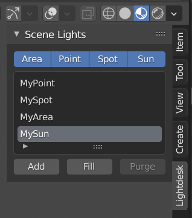
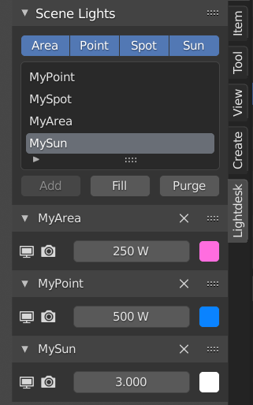

# Lightdesk

An add-on for Blender 2.8+

Lightdesk provides a lighting control panel in the sidebar of the 3D view.
Add lights from the current scene to lighting channels on the desk. Control the visibility, power, and color of multiple lights from this one location. Tweak your scene lighting without having to hunt/click individual lights in the 3D/Outliner views and selecting their light properties tab.

Select the Lightdesk tab in the 3D view sidebar ('N') to display the Scene Lights panel.

This core panel lists all the light objects in the current scene. The buttons above may be used to filter the list by various light types, which can be helpful if you have a large number of lights in your scene. Standard filter and sort by name options are also available from the drop-down section at the foot of the list.

Select a light from the list and click Add Selected to create a new lighting channel and assign the selected light to it.
Optionally, click Add All to quickly create channels for all the lights in the current scene. Channel panels can be drag-dropped to reorder and collapsed when additional screen space is required.

Each channel header contains the name of the related light object, which can be renamed from here if wanted, and a Delete Channel button. Note that clicking the Delete Channel button will not delete the associated light object, but only remove that channel from the Lightdesk view.

Operators within each channel panel are, from left to right:

1. Show/hide the light in the viewport

2. Show/hide the light in the render

3. Light power

4. Light color

Lightdesk channels and settings are configured per scene and are saved with the .blend file, so your channel setup will be recreated next time you load your project.
